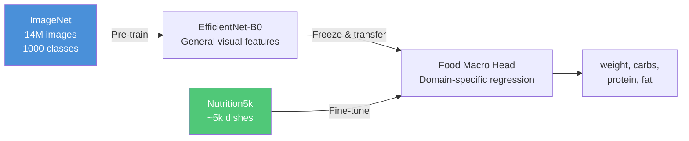

# 🍽️ Image-Based Carb & Macro Estimation for Insulin Dosing

A deep learning pipeline that estimates **food weight**, **carbohydrates**, **protein**, **fat**, and **effective carbs** from meal photos — designed as decision-support for people with insulin-dependent diabetes.

> ⚠️ **Medical Disclaimer**: This is a research prototype (V1). It is **not** a certified medical device. Never use model output as final medical advice. Always review, manually adjust, and confirm estimates before using them for insulin dosing decisions.

---

## Table of Contents

1. [Motivation & Background](#1-motivation--background)  
2. [Project Structure](#2-project-structure)  
3. [Architecture Overview](#3-architecture-overview)  
4. [Data Flow — End-to-End Pipeline](#4-data-flow--end-to-end-pipeline)  
5. [Theoretical Foundations](#5-theoretical-foundations)  
6. [Setup Instructions](#6-setup-instructions)  
7. [Data Acquisition — Nutrition5k](#7-data-acquisition--nutrition5k)  
8. [Training the Model — Step by Step](#8-training-the-model--step-by-step)  
9. [Evaluating the Model](#9-evaluating-the-model)  
10. [Using the Model — Inference](#10-using-the-model--inference)  
11. [REST API Reference](#11-rest-api-reference)  
12. [Effective Carbs — Theory & Configuration](#12-effective-carbs--theory--configuration)  
13. [Personalization](#13-personalization)  
14. [Configuration Reference](#14-configuration-reference)  
15. [Supported Backbones](#15-supported-backbones)  

---

## 1. Motivation & Background

People with **type 1 diabetes** (and insulin-dependent type 2) must estimate carbohydrate intake before each meal to calculate the correct insulin bolus dose. This process is:

- **Error-prone**: manual carb-counting varies by ±20–50% even among trained patients
- **Cognitively demanding**: especially for mixed dishes, restaurant meals, or unfamiliar foods
- **Time-sensitive**: the bolus must be delivered close to meal time for optimal glucose control

Additionally, **protein and fat** affect blood glucose on a delayed timeline (2–5 hours post-meal), which is poorly captured by simple carb counting. The concept of **"effective carbs"** attempts to model this interaction.

This project builds a **computer vision system** that takes 1–3 photos of a meal and predicts:

| Output | Description |
|--------|-------------|
| `weight_g` | Total edible mass in grams |
| `carbs_g` | Grams of carbohydrates |
| `protein_g` | Grams of protein |
| `fat_g` | Grams of fat |
| `effective_carbs_g` | Adjusted carb value accounting for protein & fat impact on glucose |

The system uses **transfer learning** on top of a pretrained **EfficientNet-B0** backbone, trained on the **Nutrition5k** dataset from Google Research.

---

## 2. Project Structure

```
L41_HomeWork/
│
├── configs/
│   └── default.yaml              # All hyperparameters in one place
│
├── src/                           # Core ML source code
│   ├── __init__.py
│   ├── config.py                  # YAML config loader + validation
│   ├── transforms.py              # Image augmentation pipelines
│   ├── dataset.py                 # FoodMacroDataset (PyTorch Dataset)
│   ├── data_utils.py              # Splitting, normalisation, DataLoaders
│   ├── backbone.py                # Pretrained backbone factory (timm)
│   ├── model.py                   # FoodMacroModel (nn.Module)
│   ├── losses.py                  # Multi-task weighted Huber loss
│   ├── metrics.py                 # MAE, RMSE, MAPE, bias metrics
│   ├── trainer.py                 # Two-phase training loop
│   ├── inference.py               # Prediction pipeline (1-3 images)
│   ├── effective_carbs.py         # Effective carbs formula engine
│   └── personalization.py         # User meal store + calibration layer
│
├── scripts/                       # Command-line entry points
│   ├── download_data.sh           # Download Nutrition5k from GCS
│   ├── prepare_nutrition5k.py     # Parse raw CSVs → processed.csv
│   ├── train.py                   # Training CLI
│   ├── predict.py                 # Prediction CLI
│   └── export_onnx.py             # ONNX model export
│
├── api/                           # Flask REST API
│   ├── __init__.py
│   ├── app.py                     # API server (3 endpoints)
│   └── schemas.py                 # Request/response dataclasses
│
├── data/
│   ├── nutrition5k/               # Downloaded dataset (via script)
│   │   ├── metadata/              # Raw CSV files from GCS
│   │   ├── imagery/               # Overhead RGB images (~5k dishes)
│   │   └── processed.csv          # Unified CSV for pipeline
│   └── sample/                    # Synthetic smoke-test data
│       ├── metadata.csv           # 10 rows of demo data
│       └── img_001..010.jpg       # Placeholder images (224×224)
│
├── models/                        # Saved model checkpoints
├── requirements.txt               # Python dependencies
├── .gitignore
└── README.md                      # This file
```

---

## 3. Architecture Overview

### 3.1 High-Level System Architecture


### 3.2 Model Component Details

| Component | Specification | Why This Choice |
|-----------|--------------|-----------------|
| **Backbone** | EfficientNet-B0 (5.3M params) | Best accuracy/efficiency trade-off among lightweight CNNs; suitable for mobile deployment |
| **Feature dim** | 1280 | Output of EfficientNet-B0's final convolutional block after global average pooling |
| **Hidden layer 1** | Linear(1280→512) + ReLU + Dropout(0.3) | Dimensionality reduction; dropout prevents overfitting when few training samples |
| **Hidden layer 2** | Linear(512→128) + ReLU | Further compression; small parameter budget for the shared representation |
| **Output layer** | Linear(128→4) | Four regression targets: `[weight, carbs, protein, fat]` |
| **Weight init** | Kaiming Normal | Standard for ReLU networks; ensures stable gradient flow at initialisation |
| **Total params** | 4,729,600 | Of which 722,052 are trainable (head only) during Phase 1 |

---

## 4. Data Flow — End-to-End Pipeline

The complete flow from raw data to insulin dosing input:

```mermaid
graph LR
    subgraph DataPrep ["Phase A: Data Preparation"]
        A1["download_data.sh<br/>Fetch from GCS"] --> A2["prepare_nutrition5k.py<br/>Parse CSVs"]
        A2 --> A3["processed.csv<br/>dish_id, image_path<br/>weight, carbs, protein, fat"]
    end

    subgraph Training ["Phase B: Model Training"]
        B1["data_utils.py<br/>GroupShuffleSplit<br/>by dish_id"] --> B2["train: 75%<br/>val: 15%<br/>test: 10%"]
        B2 --> B3["compute_target_stats<br/>z-score mean/std"]
        B3 --> B4["FoodMacroDataset<br/>+ augmentations"]
        B4 --> B5["Trainer.fit()<br/>Phase 1: frozen<br/>Phase 2: fine-tune"]
        B5 --> B6["models/best.pt"]
    end

    subgraph Inference ["Phase C: Inference"]
        C1["User takes<br/>1–3 photos"] --> C2["Load model<br/>+ checkpoint"]
        C2 --> C3["Forward pass<br/>per image"]
        C3 --> C4["Aggregate<br/>(mean/max)"]
        C4 --> C5["De-normalise<br/>→ grams"]
        C5 --> C6["Compute<br/>effective carbs"]
        C6 --> C7["JSON output"]
    end

    A3 --> B1
    B6 --> C2

    style A1 fill:#4A90D9,color:white
    style B5 fill:#E8744F,color:white
    style C7 fill:#50C878,color:white
```



### Step-by-Step Breakdown

#### Step 1: Data Download (`scripts/download_data.sh`)

The script uses **gsutil** to selectively download from Google Cloud Storage:

| What | Source | Size |
|------|--------|------|
| Metadata CSVs | `gs://nutrition5k_dataset/.../metadata/` | ~2 MB |
| Train/test splits | `gs://nutrition5k_dataset/.../dish_ids/` | <1 MB |
| Overhead RGB images | `gs://nutrition5k_dataset/.../imagery/realsense_overhead/` | ~5–10 GB |

We **skip** the 181 GB side-angle video archive — overhead images are sufficient for V1.

#### Step 2: Data Parsing (`scripts/prepare_nutrition5k.py`)

The raw Nutrition5k metadata CSVs have this format:

```
dish_id, total_calories, total_mass, total_fat, total_carb, total_protein, num_ingrs, ...
```

The script:
1. Reads `dish_metadata_cafe1.csv` and `dish_metadata_cafe2.csv`
2. Extracts `dish_id`, `weight_g` (total_mass), `carbs_g`, `protein_g`, `fat_g`
3. Matches each dish to its overhead `rgb.png` image
4. Skips dishes with missing images
5. Writes unified `data/nutrition5k/processed.csv`

#### Step 3: Data Splitting (`src/data_utils.py`)

The data is split using **GroupShuffleSplit** with `dish_id` as the grouping key:

```
Total data ──→ Train+Val (90%) ──→ Train (75% of total)
                                 └→ Val   (15% of total)
             └→ Test      (10%)
```

**Why group by dish_id?** Multiple images of the same plate must stay in the same split to prevent data leakage (the model would "memorise" specific plates rather than learning general features).

#### Step 4: Target Normalisation

Before training, target values (weight, carbs, protein, fat in grams) are **z-score normalised**:

```
target_normalised = (target - mean) / (std + ε)
```

This ensures all four regression targets have similar scales (~0 mean, ~1 std), which:
- Prevents any single target from dominating the loss gradient
- Improves optimiser stability (all learning rates are equally effective)
- Makes the λ loss weights more interpretable

The mean and std are computed from the **training set only** (to avoid information leakage) and stored in the config for use during inference de-normalisation.

#### Step 5: Image Augmentation (`src/transforms.py`)

**Training transforms** (to increase data diversity and reduce overfitting):

| Transform | Parameters | Purpose |
|-----------|-----------|---------|
| Resize | 224×224 | Match backbone input size |
| Random Horizontal Flip | p=0.5 | Food is symmetric; prevents left/right bias |
| ColorJitter | brightness=0.2, contrast=0.2, saturation=0.2, hue=0.05 | Simulates varied lighting conditions |
| RandomAffine | degrees=±10°, translate=5%, scale=90–110% | Simulates different camera angles and distances |
| ToTensor | — | Convert PIL Image to [0,1] float tensor |
| Normalize | ImageNet μ/σ | Match the pretrained backbone's expected input distribution |

**Evaluation transforms** (deterministic, no randomness):

| Transform | Parameters |
|-----------|-----------|
| Resize | 224×224 |
| ToTensor | — |
| Normalize | ImageNet μ/σ |

#### Step 6: Model Forward Pass (`src/model.py`)

The data flows through the model as follows:

```
Input image tensor: (B, 3, 224, 224)
       │
       ▼
EfficientNet-B0 backbone (pretrained on ImageNet)
       │  Convolutional feature extraction
       │  Multiple MBConv blocks with squeeze-and-excitation
       ▼
Global Average Pool → (B, 1280)
       │
       ▼
Linear(1280, 512) → ReLU → Dropout(0.3) → (B, 512)
       │
       ▼
Linear(512, 128) → ReLU → (B, 128)
       │
       ▼
Linear(128, 4) → (B, 4)
       │
       ▼
Output: [weight_norm, carbs_norm, protein_norm, fat_norm]
```

All four targets share the same backbone and hidden layers (multi-task learning). This is beneficial because food-related visual features (portion size, colour, texture) are shared across all macro targets.

#### Step 7: Loss Computation (`src/losses.py`)

The loss is a **weighted sum of per-target Smooth-L1 (Huber) losses**:

```
L_total = λ_w · L_weight + λ_c · L_carbs + λ_p · L_protein + λ_f · L_fat
```

Default weights: `λ_w=1.0`, `λ_c=2.0`, `λ_p=1.0`, `λ_f=1.0`

**Why Smooth-L1 instead of MSE?** Smooth-L1 (Huber loss) is less sensitive to outliers:

```
          ┌ 0.5 · x²        if |x| < 1          (like MSE for small errors)
L(x) =   │
          └ |x| - 0.5       if |x| ≥ 1          (like MAE for large errors)
```

This is important because food datasets have inherently noisy labels — a plate of pasta might be labeled as "350g, 60g carbs" one day and "380g, 55g carbs" another day depending on serving.

**Why is λ_carbs = 2.0?** Carbohydrate accuracy is the most clinically important target for insulin dosing. The higher weight forces the optimiser to prioritise reducing carb prediction error.

#### Step 8: Two-Phase Training (`src/trainer.py`)

Training uses a **transfer learning** strategy in two phases:

**Phase 1: Frozen Backbone (10 epochs by default)**

```
Backbone parameters: FROZEN (requires_grad = False)
Only head parameters trained
Optimizer: AdamW, lr = 1e-3
```

Rationale: The backbone already knows how to extract visual features from ImageNet. In Phase 1, we only train the small regression head to map these general features to food-specific macros. This is fast and prevents catastrophic forgetting of the backbone's pretrained knowledge.

**Phase 2: Fine-Tuning (20 epochs by default)**

```
Top-3 backbone layer groups: UNFROZEN
All head parameters: still training
Optimizer: AdamW, lr = 1e-4 (10× smaller than Phase 1)
```

Rationale: After the head has converged, we unfreeze the top layers of the backbone so they can adapt their features to be more food-specific. The lower learning rate prevents destructively overwriting pretrained features.

**Early Stopping:**

Training monitors `val_carbs_mae` (validation Mean Absolute Error for carbs). If it doesn't improve for 7 consecutive epochs, training stops and the best checkpoint is restored.

#### Step 9: Inference & De-normalisation (`src/inference.py`)

During inference on user photos:

1. Each image is processed through eval transforms (resize, normalise)
2. The model produces normalised predictions `[weight_norm, carbs_norm, ...]`
3. If multiple images are provided (up to 3), predictions are aggregated via **mean** (default) or **max** strategy
4. Predictions are **de-normalised**: `value_grams = pred_norm × std + mean`
5. Values are clamped to ≥ 0 (negative grams are not physical)
6. Effective carbs are computed from the de-normalised macros

#### Step 10: Effective Carbs (`src/effective_carbs.py`)

The final output is the **effective carbs** value — see [Section 12](#12-effective-carbs--theory--configuration) for theory.

---

## 5. Theoretical Foundations

### 5.1 Transfer Learning

**Transfer learning** is the practice of pre-training a neural network on a large, general-purpose dataset (ImageNet, 14M images, 1000 classes) and then adapting it to a smaller, specialised dataset (Nutrition5k, ~5000 food images).



**Why it works**: Low-level features (edges, textures, colours) learned from ImageNet are universal and directly useful for food recognition. Only the high-level interpretation ("this texture + this colour = mashed potatoes ≈ 30g carbs per 100g") needs to be learned from food data.

### 5.2 EfficientNet Architecture

EfficientNet uses **compound scaling** to balance network depth, width, and resolution simultaneously:

| Property | EfficientNet-B0 |
|----------|----------------|
| Parameters | 5.3M |
| Input resolution | 224×224 |
| Top-1 accuracy (ImageNet) | 77.1% |
| FLOPs | 0.39B |
| Building block | **MBConv** (Mobile Inverted Bottleneck) |

The **MBConv** block uses:
- **Depthwise separable convolutions** — factorises convolution into depthwise (per-channel spatial) + pointwise (cross-channel mixing), reducing parameters by ~8-9×
- **Squeeze-and-Excitation** — learns channel-wise attention weights, allowing the network to focus on the most informative feature channels
- **Inverted residual** — expands to a wider representation internally, processes, then projects back to a narrow dimension

### 5.3 Multi-Task Regression

Instead of building 4 separate models (one per target), we use **multi-task learning** — a single shared backbone feeds into one regression head that predicts all 4 targets simultaneously.

Benefits:
- **Shared representations**: Visual features useful for weight estimation (portion size, plate coverage) are also useful for macro estimation
- **Regularisation effect**: Predicting multiple related targets acts as an implicit regulariser, reducing overfitting
- **Efficiency**: One forward pass predicts everything, 4× faster than separate models

### 5.4 Z-Score Normalisation of Targets

Raw target ranges differ dramatically:

| Target | Typical Range | Mean ≈ | Std ≈ |
|--------|--------------|--------|-------|
| weight_g | 50–800 | 320 | 150 |
| carbs_g | 0–120 | 45 | 25 |
| protein_g | 0–80 | 22 | 15 |
| fat_g | 0–50 | 14 | 10 |

Without normalisation, the weight loss term would dominate (errors of ~100g vs ~10g for carbs), causing the network to optimise weight at the expense of carbs — the opposite of what we want clinically.

Z-scoring ensures equal error magnitudes across targets, making the λ weights meaningful.

### 5.5 Smooth L1 (Huber) Loss

For regression on real-world food data with inherent label noise:

```
                 ┌ 0.5x²      if |x| < 1
Smooth-L1(x) =  │
                 └ |x| - 0.5  if |x| ≥ 1
```

Properties:
- **Quadratic near zero** → strong gradient for small errors → precise fine-tuning
- **Linear for large errors** → bounded gradient → robust to outliers/noisy labels
- **Differentiable everywhere** → stable optimisation

---

## 6. Setup Instructions

### Prerequisites

- **macOS** (tested) / Linux
- **Python 3.12** (available via Homebrew on macOS)
- **Git** (for version control)
- **gsutil** (for dataset download — installed automatically by the script)

### Step-by-Step Setup

```bash
# 1. Clone / navigate to the project
cd /path/to/L41_HomeWork

# 2. Create a fresh Python 3.12 virtual environment
/opt/homebrew/bin/python3.12 -m venv venv

# 3. Activate the virtual environment
source venv/bin/activate

# 4. Install all dependencies
pip install -r requirements.txt
```

### Verify Installation

```bash
# Quick check — all imports should work
python -c "
from src.config import load_config
from src.model import FoodMacroModel
from src.effective_carbs import compute_effective_carbs
cfg = load_config('configs/default.yaml')
print('✅ Installation verified. Backbone:', cfg['backbone'])
"
```

### Dependencies Overview

| Package | Version | Purpose |
|---------|---------|---------|
| `torch` | ≥2.1.0 | Deep learning framework |
| `torchvision` | ≥0.16.0 | Image transforms and pretrained models |
| `timm` | ≥0.9.12 | Pretrained backbone factory (EfficientNet, ResNet, etc.) |
| `Pillow` | ≥10.0.0 | Image loading and manipulation |
| `pandas` | ≥2.1.0 | CSV data loading and manipulation |
| `scikit-learn` | ≥1.3.0 | GroupShuffleSplit for data splitting |
| `Flask` | ≥3.0.0 | REST API server |
| `PyYAML` | ≥6.0.1 | Configuration file parser |
| `onnx` | ≥1.15.0 | Model export format |
| `onnxruntime` | ≥1.16.0 | ONNX model execution |
| `matplotlib` | ≥3.8.0 | Plotting and visualisation |
| `numpy` | ≥1.26.0 | Numerical computing |

---

## 7. Data Acquisition — Nutrition5k

### About the Dataset

**Nutrition5k** is a dataset from Google Research containing scans of **5,006 plates of food** from cafeterias in California. Each dish includes:

- 4 rotating side-angle videos (we skip these in V1)
- Overhead RGB-D images
- Fine-grained ingredient list with per-ingredient mass
- **Total dish mass, calories, fat, carbs, and protein**

### Download Steps

```bash
# Make sure your venv is activated
source venv/bin/activate

# Run the download script
bash scripts/download_data.sh
```

**What the script does:**

1. Installs `gsutil` if not present
2. Downloads metadata CSVs (~2 MB) from `gs://nutrition5k_dataset/`
3. Downloads official train/test split files
4. Downloads overhead RGB images (~5–10 GB)
5. Runs `prepare_nutrition5k.py` to build `data/nutrition5k/processed.csv`

### Output

After downloading, you will have:

```
data/nutrition5k/
├── metadata/
│   ├── dish_metadata_cafe1.csv     # Raw dish metadata (cafe 1)
│   ├── dish_metadata_cafe2.csv     # Raw dish metadata (cafe 2)
│   └── ingredient_metadata.csv     # Ingredient nutritional info
├── dish_ids/
│   └── splits/                     # Official train/test splits
├── imagery/
│   └── realsense_overhead/
│       ├── dish_1556572657/rgb.png  # One overhead image per dish
│       ├── dish_1556572860/rgb.png
│       └── ...
└── processed.csv                   # ← This is what the pipeline uses
```

### Processed CSV Format

```csv
dish_id,image_path,weight_g,carbs_g,protein_g,fat_g
dish_1556572657,imagery/realsense_overhead/dish_1556572657/rgb.png,425.0,52.3,28.1,18.7
dish_1556572860,imagery/realsense_overhead/dish_1556572860/rgb.png,310.0,38.5,22.0,12.3
...
```

---

## 8. Training the Model — Step by Step

### Quick Start

```bash
source venv/bin/activate
python scripts/train.py --config configs/default.yaml --device cpu
```

For GPU acceleration (if available):
```bash
python scripts/train.py --config configs/default.yaml --device cuda
# or on Apple Silicon:
python scripts/train.py --config configs/default.yaml --device mps
```

### What Happens During Training

The `train.py` script performs the following steps in order:

#### Step 1: Load Configuration
```
Config loaded: backbone=efficientnet_b0, image_size=224
```
All hyperparameters are read from `configs/default.yaml`.

#### Step 2: Compute Target Statistics
```
Computing target statistics...
  mean=[320.5, 45.2, 22.8, 14.1], std=[152.3, 25.7, 15.3, 10.2]
```
The mean and standard deviation of each target column are computed from the full dataset. These are used for z-score normalisation.

#### Step 3: Create Data Splits
```
Creating data loaders...
  Train: 3754, Val: 752, Test: 500
```
Data is split 75/15/10 by `dish_id` using `GroupShuffleSplit`. Same-plate photos stay in the same split.

#### Step 4: Build Model
```
Model: 4,729,600 params, 722,052 trainable
```
EfficientNet-B0 backbone (frozen) + regression head. Only the head's 722K parameters are trained initially.

#### Step 5: Phase 1 — Train Head (Frozen Backbone)
```
=== Phase 1: Training head (backbone frozen) ===
  Epoch 1/10  loss=2.4531  carb_mae=18.42
  Epoch 2/10  loss=1.8723  carb_mae=14.56
  ...
  Epoch 10/10 loss=0.9812  carb_mae=9.23
```
Only the regression head learns to map ImageNet features → macro values. The backbone's pretrained weights are untouched.

#### Step 6: Phase 2 — Fine-Tune Top Backbone Layers
```
=== Phase 2: Fine-tuning backbone top layers ===
  Epoch 1/20  loss=0.8431  carb_mae=8.91
  Epoch 2/20  loss=0.7822  carb_mae=8.12
  ...
  Epoch 15/20 loss=0.5123  carb_mae=6.45
  Early stopping triggered.
```
The top 3 layer groups of EfficientNet are unfrozen and trained with 10× lower learning rate. This allows the backbone to develop food-specific features while preserving general visual knowledge.

#### Step 7: Save Best Checkpoint
```
Training complete. Best checkpoint saved.
```
The model with the lowest `val_carbs_mae` is saved to `models/best.pt`.

### Training Parameters

All configurable in `configs/default.yaml`:

| Parameter | Default | Description |
|-----------|---------|-------------|
| `epochs_frozen` | 10 | Phase 1 epochs (head only) |
| `epochs_finetune` | 20 | Phase 2 epochs (head + backbone top) |
| `lr_head` | 1e-3 | Learning rate for head parameters |
| `lr_backbone` | 1e-4 | Learning rate for unfrozen backbone |
| `batch_size` | 32 | Training batch size |
| `weight_decay` | 1e-4 | L2 regularisation coefficient |
| `optimizer` | adamw | Optimiser: `adamw` or `adam` |
| `early_stopping_patience` | 7 | Epochs to wait for improvement |
| `lambda_carbs` | 2.0 | Loss weight for carbs (highest priority) |

---

## 9. Evaluating the Model

### Metrics Computed

The system tracks four metrics for each of the four targets:

| Metric | Formula | Interpretation |
|--------|---------|----------------|
| **MAE** | `mean(│y_true − y_pred│)` | Average absolute error in grams — the primary metric |
| **RMSE** | `sqrt(mean((y_true − y_pred)²))` | Penalises large errors more heavily |
| **MAPE** | `mean(│y_true − y_pred│ / max(│y_true│, ε)) × 100` | Percentage error; useful for comparing across targets with different scales |
| **Bias** | `mean(y_pred − y_true)` | Systematic over/under-estimation; critical for safety |

### V1 Target Benchmarks

| Target | MAE Target | Clinical Significance |
|--------|-----------|----------------------|
| weight_g | ≤ 30g | Portion size accuracy |
| carbs_g | ≤ 15g | **Most critical** — directly affects insulin dose |
| protein_g | ≤ 15g | Secondary; affects delayed glucose response |
| fat_g | ≤ 15g | Secondary; affects delayed glucose response |

### Safety Note on Bias

**Bias** (mean signed error) is clinically more important than symmetric MAE. A model that consistently **underestimates** carbs by 10g is more dangerous than one with MAE of 15g but zero bias, because:

- Underestimation → insufficient insulin → hyperglycaemia
- The user can't detect the systematic error without calibration data

The system tracks bias separately and surfaces it in evaluation output.

---

## 10. Using the Model — Inference

### CLI Prediction (Single Image)

```bash
python scripts/predict.py \
    --images path/to/meal_photo.jpg \
    --checkpoint models/best.pt \
    --config configs/default.yaml
```

Output:
```json
{
  "weight_g": 320.5,
  "carbs_g": 48.2,
  "protein_g": 25.1,
  "fat_g": 14.3,
  "effective_carbs_g": 62.2,
  "num_images": 1
}
```

### Multi-Image Prediction (Better Accuracy)

Taking 2–3 photos from different angles improves accuracy by reducing occlusion errors:

```bash
python scripts/predict.py \
    --images front.jpg side.jpg overhead.jpg \
    --checkpoint models/best.pt
```

The system runs inference on each image independently, then **aggregates predictions** using the configured strategy:

| Strategy | Behaviour | Best For |
|----------|-----------|----------|
| `mean` (default) | Averages predictions across views | General use; smooths out angle-specific errors |
| `max` | Takes the maximum prediction per target | Conservative; when underestimation is more dangerous |

Configure in `configs/default.yaml`:
```yaml
multi_image_strategy: mean   # or max
```

### Programmatic Use (Python)

```python
from src.config import load_config
from src.inference import predict_meal

cfg = load_config("configs/default.yaml")

result = predict_meal(
    image_paths=["meal.jpg"],
    cfg=cfg,
    checkpoint="models/best.pt",
    device="cpu",           # or "cuda", "mps"
)

print(f"Carbs: {result['carbs_g']}g")
print(f"Effective carbs: {result['effective_carbs_g']}g")
```

### ONNX Export (For Mobile / Edge Deployment)

```bash
python scripts/export_onnx.py \
    --checkpoint models/best.pt \
    --output models/food_macro.onnx \
    --config configs/default.yaml
```

The exported model:
- **Input**: `(batch, 3, 224, 224)` float32 RGB tensor
- **Output**: `(batch, 4)` normalised predictions `[weight, carbs, protein, fat]`
- Supports dynamic batch size
- Compatible with ONNX Runtime, CoreML (via conversion), TensorFlow Lite (via conversion)

---

## 11. REST API Reference

### Start the Server

```bash
source venv/bin/activate
python api/app.py
```

Server starts at `http://localhost:5000`.

### Endpoints

#### `GET /health` — Health Check

```bash
curl http://localhost:5000/health
```

Response:
```json
{
  "status": "ok",
  "model_loaded": true,
  "backbone": "efficientnet_b0"
}
```

#### `POST /predict_meal_macros` — Predict from Images

Upload 1–3 meal images as multipart form data:

```bash
# Single image
curl -X POST http://localhost:5000/predict_meal_macros \
    -F "images=@meal_photo.jpg"

# Multiple images
curl -X POST http://localhost:5000/predict_meal_macros \
    -F "images=@front.jpg" \
    -F "images=@side.jpg" \
    -F "images=@top.jpg"
```

Response:
```json
{
  "weight_g": 320.5,
  "carbs_g": 48.2,
  "protein_g": 25.1,
  "fat_g": 14.3,
  "effective_carbs_g": 62.2,
  "num_images": 2,
  "confidence": "normal",
  "warnings": []
}
```

Error responses:
```json
{"error": "No images provided"}     // 400 — no files uploaded
{"error": "Max 3 images allowed"}   // 400 — too many images
```

#### `POST /effective_carbs` — Recalculate Effective Carbs

Useful when the user manually adjusts macro values and wants updated effective carbs without re-running inference:

```bash
curl -X POST http://localhost:5000/effective_carbs \
    -H "Content-Type: application/json" \
    -d '{
        "carbs_g": 60,
        "protein_g": 25,
        "fat_g": 15,
        "alpha": 0.5,
        "beta": 0.1,
        "method": "linear"
    }'
```

Response:
```json
{"effective_carbs_g": 74.0}
```

---

## 12. Effective Carbs — Theory & Configuration

### Why "Effective Carbs"?

Standard carb counting **only considers carbohydrates** for bolus calculation. But:

- **Protein** is ~50% converted to glucose via gluconeogenesis, peaking 3–5 hours post-meal
- **Fat** slows gastric emptying, delaying carb absorption, and contributes small amounts of glucose via glycerol

For meals high in protein and/or fat (e.g., steak with mashed potatoes), pure carb counting misses a significant glucose contribution, leading to **late-onset hyperglycemia**.

### Linear Method (Default)

```
effective_carbs = carbs + α × protein + β × fat
```

| Parameter | Default | Meaning |
|-----------|---------|---------|
| `α` (alpha) | 0.5 | 50% of protein grams treated as carb-equivalent |
| `β` (beta) | 0.1 | 10% of fat grams treated as carb-equivalent |

**Example**: A meal with 60g carbs, 25g protein, 15g fat:
```
effective_carbs = 60 + 0.5 × 25 + 0.1 × 15 = 74.0g
```

### Warsaw Method

Developed by the Warsaw Pumpers group, this method converts protein and fat to energy equivalents:

```
effective_carbs = carbs + (protein × 4 + fat × 9) / 10
```

Where:
- `protein × 4` = kcal from protein (4 kcal/g)
- `fat × 9` = kcal from fat (9 kcal/g)
- `÷ 10` = convert to carb equivalents (~10 kcal per "carb unit")

**Example**: Same meal (60g carbs, 25g protein, 15g fat):
```
effective_carbs = 60 + (25 × 4 + 15 × 9) / 10 = 60 + 23.5 = 83.5g
```

### Configuration

In `configs/default.yaml`:
```yaml
effective_carbs_alpha: 0.5
effective_carbs_beta:  0.1
# To use Warsaw method, add:
# effective_carbs_method: warsaw
```

These parameters should be **tuned per-user** with guidance from their endocrinologist.

---

## 13. Personalization

### Concept

Over time, the system can learn individual eating patterns, plate sizes, and typical portion preferences. This is implemented via two mechanisms:

### 13.1 User Meal Store

The system logs each prediction along with the user's manual corrections:

```python
from src.personalization import UserMealStore

store = UserMealStore(user_id="patient_001")

# Log a meal after user verifies/corrects the prediction
store.add_meal(
    image_paths=["dinner.jpg"],
    predicted={"weight_g": 300, "carbs_g": 50, "protein_g": 25, "fat_g": 10},
    corrected={"weight_g": 340, "carbs_g": 55, "protein_g": 28, "fat_g": 12},
)
```

Meals are stored as JSON in `data/users/{user_id}_meals.json`.

### 13.2 Calibration Layer

After collecting enough corrections (typically 10–20 meals), a per-user **calibration layer** can be trained:

```python
from src.personalization import CalibrationLayer
import numpy as np

# Gather predicted vs actual from corrections
corrections = store.get_corrections()
predicted = np.array([[m["predicted"]["weight_g"], m["predicted"]["carbs_g"],
                       m["predicted"]["protein_g"], m["predicted"]["fat_g"]]
                      for m in corrections])
actual = np.array([[m["corrected"]["weight_g"], m["corrected"]["carbs_g"],
                    m["corrected"]["protein_g"], m["corrected"]["fat_g"]]
                   for m in corrections])

# Train calibration
calibration = CalibrationLayer()
calibration.fit_from_corrections(predicted, actual, lr=0.01, steps=200)
```

The calibration layer learns **per-target scale and bias**:
```
output_calibrated = output × scale + bias
```

This corrects for systematic errors specific to the user's food habits (e.g., if the model consistently underestimates their rice portions by 20%).

---

## 14. Configuration Reference

All parameters in `configs/default.yaml`:

| Section | Parameter | Default | Description |
|---------|-----------|---------|-------------|
| **Backbone** | `backbone` | `efficientnet_b0` | timm model name |
| | `pretrained` | `true` | Use ImageNet pretrained weights |
| | `freeze_backbone` | `true` | Freeze backbone in Phase 1 |
| | `unfreeze_top_n` | `3` | Layer groups to unfreeze in Phase 2 |
| **Image** | `image_size` | `224` | Input image resolution |
| | `image_mean` | `[0.485, 0.456, 0.406]` | ImageNet channel means |
| | `image_std` | `[0.229, 0.224, 0.225]` | ImageNet channel stds |
| **Data** | `data_csv` | `data/nutrition5k/processed.csv` | Path to training CSV |
| | `data_root` | `data/nutrition5k` | Root directory for images |
| | `batch_size` | `32` | Training batch size |
| | `num_workers` | `4` | DataLoader workers |
| | `val_split` | `0.15` | Validation fraction |
| | `test_split` | `0.10` | Test fraction |
| **Normalisation** | `target_mean` | `null` | Auto-computed from data |
| | `target_std` | `null` | Auto-computed from data |
| **Training** | `epochs_frozen` | `10` | Phase 1 epochs |
| | `epochs_finetune` | `20` | Phase 2 epochs |
| | `lr_head` | `1e-3` | Head learning rate |
| | `lr_backbone` | `1e-4` | Backbone learning rate |
| | `weight_decay` | `1e-4` | L2 regularisation |
| | `optimizer` | `adamw` | `adamw` or `adam` |
| **Loss** | `loss_type` | `smooth_l1` | `smooth_l1` or `mse` |
| | `lambda_weight` | `1.0` | Weight loss coefficient |
| | `lambda_carbs` | `2.0` | Carbs loss coefficient |
| | `lambda_protein` | `1.0` | Protein loss coefficient |
| | `lambda_fat` | `1.0` | Fat loss coefficient |
| **Effective Carbs** | `effective_carbs_alpha` | `0.5` | Protein coefficient |
| | `effective_carbs_beta` | `0.1` | Fat coefficient |
| **Early Stopping** | `early_stopping_patience` | `7` | Epochs without improvement |
| | `early_stopping_metric` | `val_carbs_mae` | Metric to monitor |
| **Checkpoint** | `checkpoint_dir` | `models` | Save directory |
| | `save_best_only` | `true` | Only save best model |
| **Inference** | `multi_image_strategy` | `mean` | `mean` or `max` |

---

## 15. Supported Backbones

The backbone can be swapped by changing one line in `configs/default.yaml`:

```yaml
backbone: resnet50   # change this
```

| Backbone | Parameters | ImageNet Top-1 | Inference Speed | Recommended For |
|----------|-----------|---------------|-----------------|-----------------|
| `efficientnet_b0` ⭐ | 5.3M | 77.1% | Fast | **Default** — best accuracy/size trade-off |
| `efficientnet_b1` | 7.8M | 79.1% | Medium | Higher accuracy, still mobile-friendly |
| `resnet50` | 25.6M | 76.1% | Medium | Server-side; well-studied baseline |
| `resnet34` | 21.8M | 73.3% | Fast | Lighter ResNet variant |
| `mobilenetv2_100` | 3.4M | 72.0% | Very fast | On-device / edge deployment priority |
| `mobilenetv3_large_100` | 5.4M | 75.2% | Very fast | Modern mobile architecture |

All backbones are loaded via the [`timm`](https://github.com/huggingface/pytorch-image-models) library with `num_classes=0` to strip the classification head, exposing the raw feature vector.
