# 🍽️ Image-Based Carb & Macro Estimation for Insulin Dosing

A deep learning pipeline that estimates **food weight**, **carbohydrates**, **protein**, **fat**, and **effective carbs** from meal photos — designed as decision-support for people with insulin-dependent diabetes.

> ⚠️ **Medical Disclaimer**: This is a research prototype (v1.0.4). It is **not** a certified medical device. Never use model output as final medical advice. Always review, manually adjust, and confirm estimates before using them for insulin dosing decisions.

---

## Changelog

### v1.0.4
- Fixed model checkpoint not being uploaded to Cloud Build (`.gitignore` excluded `models/*.pt` — added `.gcloudignore` to override this)
- Fixed absolute path resolution for config and checkpoint in `app.py` (relative paths failed when Flask cwd ≠ repo root)

### v1.0.3
- Fixed OOM crash on Cloud Run: increased required memory to 4Gi (EfficientNet-B2 + CLIP together use ~1.6 GB)
- Fixed 1g weight prediction bug: model cache now re-injects `target_mean`/`target_std` into every request's config
- Baked HuggingFace model weights (EfficientNet-B2, CLIP ViT-B-32) into Docker image — eliminates cold-start 503s from HuggingFace rate limiting
- Disabled Flask debug/reloader in production (`FLASK_DEBUG=0`)
- Fixed frontend swallowing non-JSON 503 errors as "Unexpected token S"

### v1.0.2
- Added persistent medical disclaimer banner at the top of the UI
- Model cache: inference now loads the model once per process (no per-request disk I/O)
- Disabled test-time augmentation (TTA) at inference — reduces latency significantly on CPU
- Fixed missing `nutrition_db.json` in Docker image (caused nutrition lookup failures in production)

### v1.0.0
- Initial release: multi-dish meal analyser with Single Item and Composed Dish pipelines
- CLIP-based food classification for single items
- USDA FoodData Central API + local DB nutrition lookup
- Warsaw Method FPU combo bolus recommendation
- Web UI with image upload, autocomplete, and results display
- Multi-stage Dockerfile optimised for Google Cloud Run

---

## Table of Contents

1. [Motivation & Background](#1-motivation--background)
2. [Project Structure](#2-project-structure)
3. [Architecture Overview](#3-architecture-overview)
4. [Data Flow — End-to-End Pipeline](#4-data-flow--end-to-end-pipeline)
5. [Theoretical Foundations](#5-theoretical-foundations)
6. [Setup Instructions](#6-setup-instructions)
7. [Docker & Cloud Run](#7-docker--cloud-run)
8. [Data Acquisition — Nutrition5k](#8-data-acquisition--nutrition5k)
9. [Training the Model — Step by Step](#9-training-the-model--step-by-step)
10. [Evaluating the Model](#10-evaluating-the-model)
11. [Using the Product — Web UI Walkthrough](#11-using-the-product--web-ui-walkthrough)
12. [Single Dish Pipeline — CLIP Classification](#12-single-dish-pipeline--clip-classification)
13. [Composed Dish Pipeline — Direct Regression](#13-composed-dish-pipeline--direct-regression)
14. [REST API Reference](#14-rest-api-reference)
15. [Bolus Recommendation — The Warsaw Method (FPU)](#15-bolus-recommendation--the-warsaw-method-fpu)
16. [Personalization](#16-personalization)
17. [Configuration Reference](#17-configuration-reference)
18. [Supported Backbones](#18-supported-backbones)  

---

## 1. Motivation & Background

People with **type 1 diabetes** (and insulin-dependent type 2) must estimate carbohydrate intake before each meal to calculate the correct insulin bolus dose. This process is:

- **Error-prone**: manual carb-counting varies by ±20–50% even among trained patients
- **Cognitively demanding**: especially for mixed dishes, restaurant meals, or unfamiliar foods
- **Time-sensitive**: the bolus must be delivered close to meal time for optimal glucose control

Additionally, **protein and fat** affect blood glucose on a delayed timeline (2–5 hours post-meal), which is poorly captured by simple carb counting. The concept of **"effective carbs"** attempts to model this interaction.

This project builds a **computer vision system** that takes 1–3 photos of a meal and predicts:

| Output | Description |
|--------|-------------|
| `weight_g` | Total edible mass in grams |
| `carbs_g` | Grams of carbohydrates |
| `protein_g` | Grams of protein |
| `fat_g` | Grams of fat |
| `effective_carbs_g` | Adjusted carb value accounting for protein & fat impact on glucose |

The system uses **transfer learning** on top of a pretrained **EfficientNet-B2** backbone, trained on the **Nutrition5k** dataset from Google Research. A second pipeline uses **CLIP** (ViT-B-32) for zero-shot food classification of single items, combined with USDA nutrition data lookup.

---

## 2. Project Structure

```
L41_HomeWork/
│
├── configs/
│   └── default.yaml              # All hyperparameters in one place
│
├── src/                           # Core ML source code
│   ├── __init__.py
│   ├── config.py                  # YAML config loader + validation
│   ├── transforms.py              # Image augmentation pipelines
│   ├── dataset.py                 # FoodMacroDataset (PyTorch Dataset)
│   ├── data_utils.py              # Splitting, normalisation, DataLoaders
│   ├── backbone.py                # Pretrained backbone factory (timm)
│   ├── model.py                   # FoodMacroModel (nn.Module)
│   ├── losses.py                  # Multi-task weighted Huber loss
│   ├── metrics.py                 # MAE, RMSE, MAPE, bias metrics
│   ├── trainer.py                 # Two-phase training loop
│   ├── inference.py               # Prediction pipeline (1-3 images)
│   ├── effective_carbs.py         # Effective carbs formula engine
│   ├── food_classifier.py         # CLIP zero-shot food classification
│   ├── nutrition_lookup.py        # USDA API + local JSON nutrition DB
│   └── personalization.py         # User meal store + calibration layer
│
├── scripts/                       # Command-line entry points
│   ├── download_data.sh           # Download Nutrition5k from GCS
│   ├── prepare_nutrition5k.py     # Parse raw CSVs → processed.csv
│   ├── train.py                   # Training CLI
│   ├── predict.py                 # Prediction CLI
│   ├── evaluate.py                # Test set evaluation
│   └── export_onnx.py             # ONNX model export
│
├── api/                           # Flask REST API
│   ├── __init__.py
│   ├── app.py                     # Flask app factory + legacy endpoints
│   ├── meal_router.py             # Multi-dish analysis (single + composed)
│   └── schemas.py                 # Request/response dataclasses
│
├── ui/                            # Web frontend
│   ├── index.html                 # Single-page HTML shell
│   ├── app.js                     # Client-side logic (dish management, API calls)
│   └── styles.css                 # Dark-theme design system
│
├── data/
│   ├── nutrition5k/               # Downloaded dataset (via script)
│   │   ├── metadata/              # Raw CSV files from GCS
│   │   ├── imagery/               # Overhead RGB images (~5k dishes)
│   │   └── processed.csv          # Unified CSV for pipeline
│   ├── nutrition_db.json          # Local nutrition DB (~80 foods, per 100g)
│   └── sample/                    # Synthetic smoke-test data
│       ├── metadata.csv           # 10 rows of demo data
│       └── img_001..010.jpg       # Placeholder images (224×224)
│
├── models/                        # Saved model checkpoints
├── Dockerfile                     # Multi-stage Docker build (Cloud Run)
├── docker-compose.yml             # Local dev: api + training services
├── .dockerignore                  # Excludes venv, dataset, IDE files
├── requirements.txt               # Python dependencies
├── .gitignore
└── README.md                      # This file
```

---

## 3. Architecture Overview

### 3.1 High-Level System Architecture

```mermaid
graph TD
    subgraph Input
        A["📸 Meal Photos<br/>(1–3 images)"]
        B["📋 Optional Metadata<br/>(plate size, meal context)"]
    end

    subgraph Preprocessing
        C["Resize to 260×260"]
        D["ImageNet Normalisation<br/>μ=[0.485, 0.456, 0.406]<br/>σ=[0.229, 0.224, 0.225]"]
    end

    subgraph Model ["FoodMacroModel (nn.Module)"]
        E["EfficientNet-B2<br/>Pretrained Backbone<br/>(1408-dim features)"]
        F["Global Average Pooling"]
        G["Linear(1408 → 512) + ReLU"]
        H["Dropout(0.3)"]
        I["Linear(512 → 128) + ReLU"]
        J["Linear(128 → 4)"]
    end

    subgraph Postprocessing
        K["De-normalise z-scores<br/>→ grams"]
        L["Clamp to ≥ 0"]
        M["Effective Carbs<br/>= c + αp + βf"]
    end

    subgraph Output
        N["weight_g, carbs_g<br/>protein_g, fat_g<br/>effective_carbs_g"]
    end

    A --> C --> D --> E --> F --> G --> H --> I --> J
    J --> K --> L --> M --> N
    B -.-> M

    style E fill:#E8744F,color:white
    style M fill:#50C878,color:white
    style N fill:#FFD700,color:black
```



### 3.2 Dual-Mode Analysis Architecture

The system supports two distinct analysis pipelines, selected per dish:


**When to use each mode:**

| Mode | Best For | How It Works |
|------|----------|--------------|
| **Single** | One identifiable food (apple, chicken breast, rice) | Classify food type, look up known nutrition, estimate weight |
| **Composed** | Multi-ingredient dishes (salad, stir-fry, pasta) | Direct end-to-end regression from image pixels to macros |

### 3.3 Model Component Details

| Component | Specification | Why This Choice |
|-----------|--------------|-----------------|
| **Backbone** | EfficientNet-B2 (9.1M params) | Stronger feature extraction than B0; native 260px resolution captures more food detail |
| **Feature dim** | 1408 | Output of EfficientNet-B2's final convolutional block after global average pooling |
| **Hidden layer 1** | Linear(1408→512) + ReLU + Dropout(0.3) | Dimensionality reduction; dropout prevents overfitting when few training samples |
| **Hidden layer 2** | Linear(512→128) + ReLU | Further compression; small parameter budget for the shared representation |
| **Output layer** | Linear(128→4) | Four regression targets: `[weight, carbs, protein, fat]` |
| **Weight init** | Kaiming Normal | Standard for ReLU networks; ensures stable gradient flow at initialisation |
| **Total params** | ~8,488,582 | Of which ~787,588 are trainable (head only) during Phase 1 |

---

## 4. Data Flow — End-to-End Pipeline

The complete flow from raw data to insulin dosing input:


### Step-by-Step Breakdown

#### Step 1: Data Download (`scripts/download_data.sh`)

The script uses **gsutil** to selectively download from Google Cloud Storage:

| What | Source | Size |
|------|--------|------|
| Metadata CSVs | `gs://nutrition5k_dataset/.../metadata/` | ~2 MB |
| Train/test splits | `gs://nutrition5k_dataset/.../dish_ids/` | <1 MB |
| Overhead RGB images | `gs://nutrition5k_dataset/.../imagery/realsense_overhead/` | ~5–10 GB |

We **skip** the 181 GB side-angle video archive — overhead images are sufficient for V1.

#### Step 2: Data Parsing (`scripts/prepare_nutrition5k.py`)

The raw Nutrition5k metadata CSVs have this format:

```
dish_id, total_calories, total_mass, total_fat, total_carb, total_protein, num_ingrs, ...
```

The script:
1. Reads `dish_metadata_cafe1.csv` and `dish_metadata_cafe2.csv`
2. Extracts `dish_id`, `weight_g` (total_mass), `carbs_g`, `protein_g`, `fat_g`
3. Matches each dish to its overhead `rgb.png` image
4. Skips dishes with missing images
5. Writes unified `data/nutrition5k/processed.csv`

#### Step 3: Data Splitting (`src/data_utils.py`)

The data is split using **GroupShuffleSplit** with `dish_id` as the grouping key:

```
Total data ──→ Train+Val (90%) ──→ Train (75% of total)
                                 └→ Val   (15% of total)
             └→ Test      (10%)
```

**Why group by dish_id?** Multiple images of the same plate must stay in the same split to prevent data leakage (the model would "memorise" specific plates rather than learning general features).

#### Step 4: Target Normalisation

Before training, target values (weight, carbs, protein, fat in grams) are **z-score normalised**:

```
target_normalised = (target - mean) / (std + ε)
```

This ensures all four regression targets have similar scales (~0 mean, ~1 std), which:
- Prevents any single target from dominating the loss gradient
- Improves optimiser stability (all learning rates are equally effective)
- Makes the λ loss weights more interpretable

The mean and std are computed from the **training set only** (to avoid information leakage) and stored in the config for use during inference de-normalisation.

#### Step 5: Image Augmentation (`src/transforms.py`)

**Training transforms** (to increase data diversity and reduce overfitting):

| Transform | Parameters | Purpose |
|-----------|-----------|---------|
| Resize | 224×224 | Match backbone input size |
| Random Horizontal Flip | p=0.5 | Food is symmetric; prevents left/right bias |
| ColorJitter | brightness=0.2, contrast=0.2, saturation=0.2, hue=0.05 | Simulates varied lighting conditions |
| RandomAffine | degrees=±10°, translate=5%, scale=90–110% | Simulates different camera angles and distances |
| ToTensor | — | Convert PIL Image to [0,1] float tensor |
| Normalize | ImageNet μ/σ | Match the pretrained backbone's expected input distribution |

**Evaluation transforms** (deterministic, no randomness):

| Transform | Parameters |
|-----------|-----------|
| Resize | 224×224 |
| ToTensor | — |
| Normalize | ImageNet μ/σ |

#### Step 6: Model Forward Pass (`src/model.py`)

The data flows through the model as follows:

```
Input image tensor: (B, 3, 224, 224)
       │
       ▼
EfficientNet-B0 backbone (pretrained on ImageNet)
       │  Convolutional feature extraction
       │  Multiple MBConv blocks with squeeze-and-excitation
       ▼
Global Average Pool → (B, 1280)
       │
       ▼
Linear(1280, 512) → ReLU → Dropout(0.3) → (B, 512)
       │
       ▼
Linear(512, 128) → ReLU → (B, 128)
       │
       ▼
Linear(128, 4) → (B, 4)
       │
       ▼
Output: [weight_norm, carbs_norm, protein_norm, fat_norm]
```

All four targets share the same backbone and hidden layers (multi-task learning). This is beneficial because food-related visual features (portion size, colour, texture) are shared across all macro targets.

#### Step 7: Loss Computation (`src/losses.py`)

The loss is a **weighted sum of per-target Smooth-L1 (Huber) losses**:

```
L_total = λ_w · L_weight + λ_c · L_carbs + λ_p · L_protein + λ_f · L_fat
```

Default weights: `λ_w=2.0`, `λ_c=2.0`, `λ_p=1.0`, `λ_f=1.0`

**Why Smooth-L1 instead of MSE?** Smooth-L1 (Huber loss) is less sensitive to outliers:

```
          ┌ 0.5 · x²        if |x| < 1          (like MSE for small errors)
L(x) =   │
          └ |x| - 0.5       if |x| ≥ 1          (like MAE for large errors)
```

This is important because food datasets have inherently noisy labels — a plate of pasta might be labeled as "350g, 60g carbs" one day and "380g, 55g carbs" another day depending on serving.

**Why is λ_carbs = 2.0?** Carbohydrate accuracy is the most clinically important target for insulin dosing. The higher weight forces the optimiser to prioritise reducing carb prediction error.

#### Step 8: Two-Phase Training (`src/trainer.py`)

Training uses a **transfer learning** strategy in two phases:

**Phase 1: Frozen Backbone (10 epochs by default)**

```
Backbone parameters: FROZEN (requires_grad = False)
Only head parameters trained
Optimizer: AdamW, lr = 1e-3
```

Rationale: The backbone already knows how to extract visual features from ImageNet. In Phase 1, we only train the small regression head to map these general features to food-specific macros. This is fast and prevents catastrophic forgetting of the backbone's pretrained knowledge.

**Phase 2: Fine-Tuning (20 epochs by default)**

```
Top-3 backbone layer groups: UNFROZEN
All head parameters: still training
Optimizer: AdamW, lr = 1e-4 (10× smaller than Phase 1)
```

Rationale: After the head has converged, we unfreeze the top layers of the backbone so they can adapt their features to be more food-specific. The lower learning rate prevents destructively overwriting pretrained features.

**Early Stopping:**

Training monitors `val_carbs_mae` (validation Mean Absolute Error for carbs). If it doesn't improve for 7 consecutive epochs, training stops and the best checkpoint is restored.

#### Step 9: Inference & De-normalisation (`src/inference.py`)

During inference on user photos:

1. Each image is processed through eval transforms (resize, normalise)
2. The model produces normalised predictions `[weight_norm, carbs_norm, ...]`
3. If multiple images are provided (up to 3), predictions are aggregated via **mean** (default) or **max** strategy
4. Predictions are **de-normalised**: `value_grams = pred_norm × std + mean`
5. Values are clamped to ≥ 0 (negative grams are not physical)
6. Effective carbs are computed from the de-normalised macros

#### Step 10: Effective Carbs (`src/effective_carbs.py`)

The final output is the **effective carbs** value — see [Section 15](#15-bolus-recommendation--the-warsaw-method-fpu) for theory.

---

## 5. Theoretical Foundations

### 5.1 Transfer Learning

**Transfer learning** is the practice of pre-training a neural network on a large, general-purpose dataset (ImageNet, 14M images, 1000 classes) and then adapting it to a smaller, specialised dataset (Nutrition5k, ~5000 food images).


**Why it works**: Low-level features (edges, textures, colours) learned from ImageNet are universal and directly useful for food recognition. Only the high-level interpretation ("this texture + this colour = mashed potatoes ≈ 30g carbs per 100g") needs to be learned from food data.

### 5.2 EfficientNet Architecture

EfficientNet uses **compound scaling** to balance network depth, width, and resolution simultaneously:

| Property | EfficientNet-B0 |
|----------|----------------|
| Parameters | 5.3M |
| Input resolution | 224×224 |
| Top-1 accuracy (ImageNet) | 77.1% |
| FLOPs | 0.39B |
| Building block | **MBConv** (Mobile Inverted Bottleneck) |

The **MBConv** block uses:
- **Depthwise separable convolutions** — factorises convolution into depthwise (per-channel spatial) + pointwise (cross-channel mixing), reducing parameters by ~8-9×
- **Squeeze-and-Excitation** — learns channel-wise attention weights, allowing the network to focus on the most informative feature channels
- **Inverted residual** — expands to a wider representation internally, processes, then projects back to a narrow dimension

### 5.3 Multi-Task Regression

Instead of building 4 separate models (one per target), we use **multi-task learning** — a single shared backbone feeds into one regression head that predicts all 4 targets simultaneously.

Benefits:
- **Shared representations**: Visual features useful for weight estimation (portion size, plate coverage) are also useful for macro estimation
- **Regularisation effect**: Predicting multiple related targets acts as an implicit regulariser, reducing overfitting
- **Efficiency**: One forward pass predicts everything, 4× faster than separate models

### 5.4 Z-Score Normalisation of Targets

Raw target ranges differ dramatically:

| Target | Typical Range | Mean ≈ | Std ≈ |
|--------|--------------|--------|-------|
| weight_g | 50–800 | 320 | 150 |
| carbs_g | 0–120 | 45 | 25 |
| protein_g | 0–80 | 22 | 15 |
| fat_g | 0–50 | 14 | 10 |

Without normalisation, the weight loss term would dominate (errors of ~100g vs ~10g for carbs), causing the network to optimise weight at the expense of carbs — the opposite of what we want clinically.

Z-scoring ensures equal error magnitudes across targets, making the λ weights meaningful.

### 5.5 Smooth L1 (Huber) Loss

For regression on real-world food data with inherent label noise:

```
                 ┌ 0.5x²      if |x| < 1
Smooth-L1(x) =  │
                 └ |x| - 0.5  if |x| ≥ 1
```

Properties:
- **Quadratic near zero** → strong gradient for small errors → precise fine-tuning
- **Linear for large errors** → bounded gradient → robust to outliers/noisy labels
- **Differentiable everywhere** → stable optimisation

---

## 6. Setup Instructions

### Prerequisites

- **macOS** (tested) / Linux
- **Python 3.12** (available via Homebrew on macOS)
- **Git** (for version control)
- **gsutil** (for dataset download — installed automatically by the script)

### Step-by-Step Setup

```bash
# 1. Clone / navigate to the project
cd /path/to/L41_HomeWork

# 2. Create a fresh Python 3.12 virtual environment
/opt/homebrew/bin/python3.12 -m venv venv

# 3. Activate the virtual environment
source venv/bin/activate

# 4. Install all dependencies
pip install -r requirements.txt
```

### Verify Installation

```bash
# Quick check — all imports should work
python -c "
from src.config import load_config
from src.model import FoodMacroModel
from src.effective_carbs import compute_effective_carbs
cfg = load_config('configs/default.yaml')
print('✅ Installation verified. Backbone:', cfg['backbone'])
"
```

### Dependencies Overview

| Package | Version | Purpose |
|---------|---------|---------|
| `torch` | ≥2.1.0 | Deep learning framework |
| `torchvision` | ≥0.16.0 | Image transforms and pretrained models |
| `timm` | ≥0.9.12 | Pretrained backbone factory (EfficientNet, ResNet, etc.) |
| `Pillow` | ≥10.0.0 | Image loading and manipulation |
| `pandas` | ≥2.1.0 | CSV data loading and manipulation |
| `scikit-learn` | ≥1.3.0 | GroupShuffleSplit for data splitting |
| `Flask` | ≥3.0.0 | REST API server |
| `PyYAML` | ≥6.0.1 | Configuration file parser |
| `onnx` | ≥1.15.0 | Model export format |
| `onnxruntime` | ≥1.16.0 | ONNX model execution |
| `matplotlib` | ≥3.8.0 | Plotting and visualisation |
| `numpy` | ≥1.26.0 | Numerical computing |
| `open-clip-torch` | ≥2.24.0 | CLIP zero-shot food classification (ViT-B-32) |
| `pillow-heif` | ≥0.16.0 | HEIC/HEIF image support (iPhone photos) |

---

## 7. Docker & Cloud Run

The project includes a **multi-stage Dockerfile** optimised for deployment to **Google Cloud Run** (CPU-only, serverless).

### Build the Docker Image

```bash
docker build -t food-macro-api .
```

The image uses **CPU-only PyTorch** (~1.5 GB) to keep cold starts fast on Cloud Run.

### Run Locally with Docker

```bash
# Start the API server
docker run --rm -p 5001:8080 \
  -v ./models:/app/models \
  food-macro-api

# Test it
curl http://localhost:5001/health
```

### Run with Docker Compose

```bash
# Start the API
docker compose up api

# Run training (one-off)
docker compose run --rm train
```

### Deploy to Cloud Run

```bash
# 1. Set your project variables
export PROJECT_ID=your-gcp-project-id
export REGION=us-central1
export REPO=your-artifact-registry-repo   # e.g. food-macro-app

# 2. Enable required APIs (first time only)
gcloud services enable run.googleapis.com \
    artifactregistry.googleapis.com \
    cloudbuild.googleapis.com \
    storage.googleapis.com

# 3. Create Artifact Registry repository (first time only)
gcloud artifacts repositories create ${REPO} \
    --repository-format=docker \
    --location=${REGION}

# 4. Build & push via Cloud Build (builds natively on linux/amd64 — no platform flag needed)
gcloud builds submit \
    --tag ${REGION}-docker.pkg.dev/${PROJECT_ID}/${REPO}/api:latest .

# 5. Deploy
gcloud run deploy food-macro-api \
    --image ${REGION}-docker.pkg.dev/${PROJECT_ID}/${REPO}/api:latest \
    --platform managed \
    --region ${REGION} \
    --port 8080 \
    --memory 2Gi \
    --cpu 2 \
    --timeout 300 \
    --allow-unauthenticated
```

> **Apple Silicon (M1/M2/M3) note**: Cloud Build runs on `linux/amd64` natively, so no `--platform` flag is needed. If building locally with Docker instead, add `--platform linux/amd64` to the `docker build` command.

Cloud Run automatically injects the `PORT` environment variable — the API reads it at startup.

#### Required IAM permissions (if Cloud Build fails with permission errors)

```bash
export SA=your-compute-service-account@developer.gserviceaccount.com

# Allow pushing images to Artifact Registry
gcloud artifacts repositories add-iam-policy-binding ${REPO} \
    --location=${REGION} \
    --member="serviceAccount:${SA}" \
    --role="roles/artifactregistry.writer"

# Allow writing build logs
gcloud projects add-iam-policy-binding ${PROJECT_ID} \
    --member="serviceAccount:${SA}" \
    --role="roles/logging.logWriter"

# Allow reading from the Cloud Build GCS bucket
gcloud projects add-iam-policy-binding ${PROJECT_ID} \
    --member="serviceAccount:${SA}" \
    --role="roles/storage.objectAdmin"
```

### Docker Architecture

| Stage | Base | Purpose |
|-------|------|---------|
| Builder | `python:3.12-slim` | Install CPU-only PyTorch + all deps into venv |
| Runtime | `python:3.12-slim` | Copy venv + app code only → minimal final image |

---

## 8. Data Acquisition — Nutrition5k

### About the Dataset

**Nutrition5k** is a dataset from Google Research containing scans of **5,006 plates of food** from cafeterias in California. Each dish includes:

- 4 rotating side-angle videos (we skip these in V1)
- Overhead RGB-D images
- Fine-grained ingredient list with per-ingredient mass
- **Total dish mass, calories, fat, carbs, and protein**

### Download Steps

```bash
# Make sure your venv is activated
source venv/bin/activate

# Run the download script
bash scripts/download_data.sh
```

**What the script does:**

1. Installs `gsutil` if not present
2. Downloads metadata CSVs (~2 MB) from `gs://nutrition5k_dataset/`
3. Downloads official train/test split files
4. Downloads overhead RGB images (~5–10 GB)
5. Runs `prepare_nutrition5k.py` to build `data/nutrition5k/processed.csv`

### Data Cleaning

During CSV preparation, `prepare_nutrition5k.py` applies automatic outlier filtering:

| Filter | Threshold | Reason |
|--------|-----------|--------|
| Extreme weight | weight > 800g | Likely measurement errors (only 2 dishes in raw data) |
| Extreme carbs | carbs > 200g | Physiologically unlikely for a single serving |
| Zero macros | carbs + protein + fat = 0 | No nutritional information |

This removes ~248 noisy samples (5,006 raw → ~3,242 clean dishes), improving training stability.

### Output

After downloading, you will have:

```
data/nutrition5k/
├── metadata/
│   ├── dish_metadata_cafe1.csv     # Raw dish metadata (cafe 1)
│   ├── dish_metadata_cafe2.csv     # Raw dish metadata (cafe 2)
│   └── ingredient_metadata.csv     # Ingredient nutritional info
├── dish_ids/
│   └── splits/                     # Official train/test splits
├── imagery/
│   └── realsense_overhead/
│       ├── dish_1556572657/rgb.png  # One overhead image per dish
│       ├── dish_1556572860/rgb.png
│       └── ...
└── processed.csv                   # ← This is what the pipeline uses
```

### Processed CSV Format

All macro values are **per total dish weight** (not per 100g):

```csv
dish_id,image_path,weight_g,carbs_g,protein_g,fat_g
dish_1556572657,imagery/realsense_overhead/dish_1556572657/rgb.png,425.0,52.3,28.1,18.7
dish_1556572860,imagery/realsense_overhead/dish_1556572860/rgb.png,310.0,38.5,22.0,12.3
...
```

---

## 9. Training the Model — Step by Step

### Quick Start

```bash
# Step 0: Activate environment
source venv/bin/activate

# Step 1: Train (Apple Silicon GPU — recommended)
python scripts/train.py --config configs/default.yaml --device mps

# Alternative: CPU only
python scripts/train.py --config configs/default.yaml --device cpu

# Alternative: NVIDIA GPU (Linux/Windows)
python scripts/train.py --config configs/default.yaml --device cuda
```

> 💡 **Apple Silicon users** (M1/M2/M3/M4): use `--device mps` to leverage the Metal Performance Shaders GPU backend for significantly faster training.

### Image Preprocessing

Before reaching the model, every image goes through a preprocessing pipeline:

#### During Training (with augmentation)

```
1. Resize → 260×260 px          All images become the same size
2. RandomHorizontalFlip(0.5)     Mirrors the image 50% of the time
3. ColorJitter                   Random brightness/contrast/saturation/hue
4. RandomAffine                  Slight rotation (±15°), shift (±8%), scale (85-115%)
5. RandomPerspective(0.1)        Simulates different viewing angles
6. ToTensor                      Converts to float [0.0–1.0]
7. Normalize(ImageNet μ/σ)       Channel-wise: (pixel - mean) / std
8. RandomErasing(0.2)            Randomly blacks out a small patch (simulates occlusion)
```

Augmentation forces the model to recognise food regardless of plate orientation, lighting conditions, or partial occlusion (e.g., a fork covering part of the meal).

#### During Evaluation / Inference

```
1. Resize → 260×260 px
2. ToTensor
3. Normalize(ImageNet μ/σ)
```

> **Why 260×260?** Each EfficientNet variant has a **native resolution** optimised during its original training. B2's native resolution is 260px. Using the native size ensures the pretrained spatial features align correctly with the input.

| Backbone | Native Resolution | Why |
|----------|------------------|-----|
| B0 | 224×224 | Smallest, fastest |
| B1 | 240×240 | Slight upgrade |
| **B2** | **260×260** | **Current default** — best accuracy/speed for this dataset |
| B3 | 300×300 | Larger; more detail but slower |

### What Happens During Training

The `train.py` script performs the following steps in order:

#### Step 1: Load Configuration
```
Config loaded: backbone=efficientnet_b2, image_size=260
```
All hyperparameters are read from `configs/default.yaml`.

#### Step 2: Compute Target Statistics
```
Computing target statistics...
  mean=[202.9, 18.9, 17.7, 12.7], std=[146.4, 15.8, 19.6, 13.5]
```
The mean and standard deviation of each target column are computed from the full dataset. These are used for **z-score normalisation** — the model predicts normalised values during training, which are converted back to grams at inference time.

#### Step 3: Create Data Splits
```
Creating data loaders...
  Train: 2430, Val: 487, Test: 325
```
Data is split 75/15/10 by `dish_id` using `GroupShuffleSplit`. Same-plate photos stay in the same split to prevent data leakage.

#### Step 4: Build Model
```
Model: 8,488,582 params, 787,588 trainable
```
EfficientNet-B2 backbone (frozen) + regression head. Only the head's ~788K parameters are trained initially.

#### Step 5: Phase 1 — Train Head (Frozen Backbone)
```
=== Phase 1: Training head (backbone frozen) ===
  Epoch 1/10  loss=1.8116  carb_mae=0.59  lr=1.00e-03
  Epoch 2/10  loss=1.4657  carb_mae=0.57  lr=9.76e-04
  ...
  Epoch 10/10 loss=1.0563  carb_mae=0.48  lr=2.54e-05
```
Only the regression head learns to map ImageNet features → macro values. The backbone's pretrained weights are untouched. The **cosine LR scheduler** gradually reduces the learning rate from 1e-3 to near-zero.

#### Step 6: Phase 2 — Fine-Tune Top Backbone Layers
```
=== Phase 2: Fine-tuning backbone top layers ===
  Epoch 1/30  loss=1.0683  carb_mae=0.47  lr=1.00e-04
  Epoch 2/30  loss=1.0286  carb_mae=0.45  lr=9.97e-05
  ...
  Epoch 30/30 loss=0.7306  carb_mae=0.41  lr=1.27e-06
```
The top 4 layer groups of EfficientNet are unfrozen and trained with 10× lower learning rate. This allows the backbone to develop **food-specific features** while preserving general visual knowledge from ImageNet pretraining.

#### Step 7: Save Best Checkpoint
```
Training complete. Best checkpoint saved.
```
The model with the lowest `val_carbs_g_mae` is saved to `models/best.pt`. The checkpoint includes the model weights, target statistics, and full config for self-contained inference.

### Loss Function

The model uses a **weighted multi-task loss**:

```
Loss = λ_w·L(weight) + λ_c·L(carbs) + λ_p·L(protein) + λ_f·L(fat)
```

Two loss types are supported:

| Loss Type | Formula | Behaviour | Best For |
|-----------|---------|-----------|----------|
| `smooth_l1` | Huber loss | L1 for large errors, L2 for small | Robust to outliers (default) |
| `mse` | Mean Squared Error | Penalises large errors quadratically | When reducing big errors matters most |

The loss weights (`lambda_*`) let you prioritise specific targets — carbs and weight are set to 2.0 since carbs directly affects insulin dosing and weight has the largest absolute errors.

### Cosine LR Scheduler

Instead of a fixed learning rate, the system uses **CosineAnnealingLR** which gradually decreases the learning rate following a cosine curve:

```
lr(t) = lr_min + 0.5 × (lr_max - lr_min) × (1 + cos(π × t / T))
```

This prevents **late-epoch overfitting** — as training progresses, the smaller learning rate makes increasingly conservative parameter updates, reducing the risk of fitting to noise.

### Anti-Overfitting Measures

| Guard | Mechanism |
|-------|----------|
| Early stopping | Stops if val_carbs_g_mae doesn't improve for 7 epochs |
| Dropout (0.3) | Randomly drops 30% of activations in the regression head |
| Weight decay (5e-4) | L2 regularisation penalises large weights |
| Data augmentation | 6 random transforms per training image |
| Cosine LR schedule | Prevents late-epoch overfitting |
| Frozen backbone (Phase 1) | Head converges before backbone adapts |

### Training Parameters

All configurable in `configs/default.yaml`:

| Parameter | Default | Description |
|-----------|---------|-------------|
| `epochs_frozen` | 10 | Phase 1 epochs (head only) |
| `epochs_finetune` | 30 | Phase 2 epochs (head + backbone top) |
| `lr_head` | 1e-3 | Learning rate for head parameters |
| `lr_backbone` | 1e-4 | Learning rate for unfrozen backbone |
| `batch_size` | 32 | Training batch size |
| `weight_decay` | 5e-4 | L2 regularisation coefficient |
| `scheduler` | cosine | LR schedule: `cosine` or `none` |
| `optimizer` | adamw | Optimiser: `adamw` or `adam` |
| `early_stopping_patience` | 7 | Epochs to wait for improvement |
| `lambda_weight` | 2.0 | Loss weight for weight (boosted) |
| `lambda_carbs` | 2.0 | Loss weight for carbs (highest priority) |

---

## 10. Evaluating the Model

### Running Evaluation on the Test Set

After training, run the evaluation script to measure accuracy on the held-out test split:

```bash
# Step 2: Evaluate on the test set
python scripts/evaluate.py \
    --config configs/default.yaml \
    --checkpoint models/best.pt \
    --device mps
```

This will output:
- A **metrics table** showing MAE, RMSE, MAPE, and Bias for each target
- **Per-sample predictions** (true vs. predicted values) for small test sets

Example output:
```
========================================================
  TEST SET EVALUATION RESULTS
========================================================
Metric       Weight      Carbs    Protein        Fat
----------------------------------------------------
mae           32.50      12.30       8.45       6.20
rmse          45.10      16.80      11.20       8.90
mape          12.40      28.50      35.20      42.10
bias          -5.20       3.10      -2.30       1.40
========================================================
```

### Metrics Computed

The system tracks four metrics for each of the four targets:

| Metric | Formula | Interpretation |
|--------|---------|----------------|
| **MAE** | `mean(│y_true − y_pred│)` | Average absolute error in grams — the primary metric |
| **RMSE** | `sqrt(mean((y_true − y_pred)²))` | Penalises large errors more heavily |
| **MAPE** | `mean(│y_true − y_pred│ / max(│y_true│, ε)) × 100` | Percentage error; useful for comparing across targets with different scales |
| **Bias** | `mean(y_pred − y_true)` | Systematic over/under-estimation; critical for safety |

### V1 Target Benchmarks

| Target | MAE Target | Clinical Significance |
|--------|-----------|----------------------|
| weight_g | ≤ 30g | Portion size accuracy |
| carbs_g | ≤ 15g | **Most critical** — directly affects insulin dose |
| protein_g | ≤ 15g | Secondary; affects delayed glucose response |
| fat_g | ≤ 15g | Secondary; affects delayed glucose response |

### Safety Note on Bias

**Bias** (mean signed error) is clinically more important than symmetric MAE. A model that consistently **underestimates** carbs by 10g is more dangerous than one with MAE of 15g but zero bias, because:

- Underestimation → insufficient insulin → hyperglycaemia
- The user can't detect the systematic error without calibration data

The system tracks bias separately and surfaces it in evaluation output.

---

## 11. Using the Product — Web UI Walkthrough

The web interface is served by the Flask API at `http://localhost:5001`. It allows users to analyse up to 5 dishes per meal in two modes.

### Starting the Server

```bash
source venv/bin/activate
python api/app.py
```

**What happens at startup** (`api/app.py:30-38`):

1. `create_app()` loads the config from `configs/default.yaml` via `src/config.py`
2. Resolves the checkpoint path: `models/best.pt`
3. Calls `init_meal_blueprint(cfg, checkpoint)` to inject config into the meal router
4. Registers the `meal_bp` blueprint (defined in `api/meal_router.py`)
5. Flask starts serving the UI on port 5001

### Step 1: Page Load

When the user opens `http://localhost:5001`:

1. **`GET /`** serves `ui/index.html` (`api/app.py:46-48`) — a minimal HTML shell with a header, dishes container, loading spinner, and results area.

2. **`ui/app.js`** loads and runs `DOMContentLoaded` (`ui/app.js:19-33`):
   - Calls `addDish()` to create the first dish card
   - Attaches click handlers to "Add Dish", "Analyse Meal", and "New Analysis" buttons
   - Fetches `GET /api/foods` (`api/meal_router.py:146-149`) to pre-load the food name autocomplete list. This calls `list_foods()` from `src/nutrition_lookup.py:134-137`, which returns sorted keys from `data/nutrition_db.json`

### Step 2: Adding Dishes

Each dish card (`ui/app.js:36-127`) contains:

- **Mode toggle** — two buttons: "Single Item" and "Composed Dish"
- **Single mode inputs** — image upload (1 photo) + optional food name and weight override fields
- **Composed mode inputs** — image upload (up to 3 photos) + optional dish name
- **Remove button** — deletes the dish card

State is tracked in the `dishData` object (`ui/app.js:13-14`):
```javascript
dishData[id] = { mode: 'single', name: '', files: [], weight: '' }
```

The user can add up to `MAX_DISHES = 5` dishes. Each starts in single mode by default.

### Step 3: Mode Selection

When the user clicks a mode button, `setMode(id, mode)` (`ui/app.js:129-161`):

1. Resets the dish state (clears files, name, weight)
2. Toggles visibility: shows single-mode inputs or composed-mode inputs
3. Updates the active button styling (`.mode-btn.active` in `ui/styles.css:224-228`)

**Single mode** — user uploads **one** photo of a recognisable food item (e.g. a tomato, a chicken breast). The food name and weight are auto-detected from the image. Optional override fields let the user type a food name or weight if they know it.

**Composed mode** — user uploads **1-3** photos of a multi-ingredient dish (e.g. pasta with sauce, a salad). The Nutrition5k model predicts macros directly from the images.

### Step 4: Image Upload

**Single mode** — `triggerSingleUpload()` and `handleSingleFile()` (`ui/app.js:245-267`):
- Opens the file picker (limited to `accept="image/*"`)
- Replaces any existing image (only 1 allowed)
- Shows a preview thumbnail with a remove button

**Composed mode** — `triggerUpload()` and `handleFiles()` (`ui/app.js:184-225`):
- Opens the file picker with `multiple` attribute
- Appends files up to `MAX_IMAGES = 3`
- Renders preview thumbnails with individual remove buttons
- Shows image count ("2 / 3 images")

### Step 5: Clicking "Analyse Meal"

When the user clicks the primary button, `analyseMeal()` (`ui/app.js:329-401`) runs:

1. **Filter valid dishes** — only dishes with data (single: image or name+weight; composed: at least 1 image)
2. **Show loading spinner** — `showLoading(true)` displays the spinner (`ui/styles.css:334-364`)
3. **Build FormData** — for each valid dish, appends:
   - `dish_N_mode` — `"single"` or `"composed"`
   - `dish_N_name` — food/dish name (may be empty for auto-detection)
   - `dish_N_weight` — manual weight override (single mode only, may be empty)
   - `dish_N_images` — image file(s)
4. **POST to `/api/analyse_meal`** — the FormData is sent as `multipart/form-data`
5. **Handle response** — on success, calls `renderResults()`; on error, calls `showError()`

### Step 6: Backend Analysis

The request arrives at `analyse_meal()` in `api/meal_router.py:154-270`:

1. **Parse dishes** — iterates through `dish_0_*`, `dish_1_*`, etc., reading mode, name, weight, and images from the form data
2. **Per-dish analysis** — dispatches to the appropriate handler:
   - **Single**: `_analyse_single()` (`api/meal_router.py:275-384`) — see [Section 12](#12-single-dish-pipeline--clip-classification)
   - **Composed**: `_analyse_composed()` (`api/meal_router.py:387-403`) — see [Section 13](#13-composed-dish-pipeline--direct-regression)
3. **Meal totals** — sums weight, carbs, protein, fat across all dishes
4. **Bolus recommendation** — calls `bolus_recommendation_from_config()` from `src/effective_carbs.py` using meal totals
5. **Cleanup** — deletes all temporary image files in a `finally` block

### Step 7: Results Display

`renderResults(data, previewUrls)` (`ui/app.js:404-570`) builds three visual sections:

**Per-dish result cards** — for each dish:
- Thumbnail preview (from the uploaded image)
- Food name + mode badge ("Single" / "Composed")
- Source badge for single mode ("USDA" green or "Local DB" amber)
- USDA matched description (if different from input name)
- Classification info bar (single mode only): shows CLIP-identified food name + confidence %
- Macro grid: weight, carbs, protein, fat

**Meal totals card** — aggregated macros + Fat-Protein Units, equivalent carbs, and total active carbs

**Bolus recommendation card** — dual-wave insulin pump recommendation:
- Immediate bolus (carbs portion, at meal time)
- Extended bolus (fat+protein portion, delivered over N hours)
- Total insulin units
- Medical disclaimer

### Step 8: New Analysis

Clicking "New Analysis" calls `resetAll()` (`ui/app.js:317-326`), which clears all state, removes the results, and adds a fresh first dish card.

---

## 12. Single Dish Pipeline — CLIP Classification

When a dish is set to **single mode**, the backend runs a 4-step pipeline that combines image classification, nutrition database lookup, and weight estimation.

### Step 1: Image Classification (`src/food_classifier.py`)

The classifier uses **CLIP** (Contrastive Language-Image Pre-training) for zero-shot food identification. CLIP can classify images against arbitrary text labels without any food-specific training.

**Model**: ViT-B-32 pretrained on LAION-2B (~400M image-text pairs)

**How it works** (`src/food_classifier.py:55-88`):

1. On first call, `_load_model()` loads the CLIP model and tokeniser
2. Builds a combined label set from two sources:
   - **Food-101 labels** — 101 dish categories (pizza, sushi, hamburger, etc.) defined in `FOOD_101_LABELS` (`src/food_classifier.py:16-45`)
   - **Local nutrition DB keys** — ~80 ingredient names (tomato, chicken breast, rice, etc.) loaded from `data/nutrition_db.json`
3. Pre-computes text embeddings for all ~170 labels using the prompt template `"a photo of {name}, a type of food"`
4. Caches everything in module globals for subsequent calls

**Classification** (`src/food_classifier.py:91-120`):

1. Opens the image and applies CLIP's preprocessing (resize, centre crop, normalise)
2. Encodes the image into a 512-dim feature vector
3. Computes cosine similarity against all pre-computed text embeddings
4. Applies softmax to get probability distribution
5. Returns top-3 predictions with confidence scores:
   ```python
   [{"name": "tomato", "confidence": 0.72}, {"name": "red pepper", "confidence": 0.11}, ...]
   ```

**Minimum confidence threshold** (`api/meal_router.py:296`):

The top-1 prediction must reach **≥ 10% confidence** to be accepted. If it falls below this threshold, the API returns a `422` error asking the user to enter the food name manually. The error message includes the model's best guess and its confidence so the user can decide whether to use it:

```
"Could not confidently classify food from image (need ≥10% confidence).
 Best guess: 'baklava' (34% confidence). Please enter the food name manually."
```

This prevents low-confidence misclassifications from silently propagating incorrect nutrition data through the rest of the pipeline.

### Step 2: Nutrition Lookup (`src/nutrition_lookup.py`)

Once the food is identified (either by CLIP with ≥10% confidence or by the user manually), `lookup_food(name)` (`src/nutrition_lookup.py:94-107`) retrieves nutrition facts per 100g:

**Primary source — USDA FoodData Central API** (`src/nutrition_lookup.py:32-69`):
- Queries `https://api.nal.usda.gov/fdc/v1/foods/search` (free, uses `DEMO_KEY` by default)
- Filters for "Foundation" and "SR Legacy" data types (high-quality lab-measured data)
- Extracts: carbs, protein, fat, calories per 100g
- Returns source as `"usda_api"` with the USDA's matched description

**Fallback — local JSON database** (`src/nutrition_lookup.py:72-91`):
- Searches `data/nutrition_db.json` (~80 common foods with lab-verified per-100g macros)
- Tries exact case-insensitive match first
- Falls back to fuzzy matching via `difflib.get_close_matches(cutoff=0.6)`
- Returns source as `"local_db"`

**Fallback across CLIP candidates** — if the top-1 CLIP prediction doesn't match any nutrition source, the router tries the top-3 candidates (`api/meal_router.py:317-323`).

### Step 3: Weight Estimation (`src/inference.py`)

If the user didn't manually enter a weight, the system estimates it from the image using the same **Nutrition5k model** used for composed dishes:

```python
model_pred = predict_meal(temp_paths, _cfg, checkpoint=ckpt)
weight_g = model_pred["weight_g"]
```

(`api/meal_router.py:344-351`)

The model runs the full inference pipeline (`src/inference.py:79-137`):
1. Loads `FoodMacroModel` from `models/best.pt`
2. Applies eval transforms (resize 260x260, ImageNet normalise)
3. Optional TTA (5 augmented views averaged)
4. De-normalises using training set statistics
5. The `weight_g` output is extracted; other predictions (carbs, protein, fat) are discarded since the nutrition lookup provides more accurate per-food values

### Step 4: Final Calculation (`api/meal_router.py:362-375`)

```python
scale = weight_g / 100.0
prediction = {
    "weight_g": round(weight_g, 1),
    "carbs_g": round(macros_per100["carbs_g"] * scale, 1),
    "protein_g": round(macros_per100["protein_g"] * scale, 1),
    "fat_g": round(macros_per100["fat_g"] * scale, 1),
    ...
}
```

The final macros are: `nutrition_per_100g * estimated_weight / 100`.

### Optional Manual Overrides

The user can override either auto-detected value:
- **Food name override** — skips CLIP classification, uses the typed name for USDA lookup
- **Weight override** — skips model weight estimation, uses the typed weight in grams

This is handled in `_analyse_single()` (`api/meal_router.py:275-384`) by checking whether `food_name` and `weight_str` are non-empty before running the respective auto-detection step.

---

## 13. Composed Dish Pipeline — Direct Regression

When a dish is set to **composed mode**, the system uses the Nutrition5k-trained model for end-to-end macro prediction.

### Image Processing (`api/meal_router.py:387-403`)

1. Each uploaded image is saved via `_save_upload()` (`api/meal_router.py:45-141`):
   - Handles HEIC/HEIF format (iPhone photos) via `pillow-heif`
   - Strips stray CRLF bytes from multipart parser leaks
   - Falls back to macOS `sips` for format conversion
   - Saves as clean PNG temp file

2. All image paths are passed to `predict_meal()` (`src/inference.py:79-137`)

### Model Inference (`src/inference.py`)

**Step 1 — Load model** (`src/inference.py:21-43`):
- Instantiates `FoodMacroModel(cfg)` (`src/model.py:20-44`):
  - `get_backbone("efficientnet_b2", pretrained=True)` creates the backbone via `timm` (`src/backbone.py:18-37`)
  - Regression head: `Linear(1408 → 512) → ReLU → Dropout(0.3) → Linear(512 → 128) → ReLU → Linear(128 → 4)`
- Loads checkpoint weights from `models/best.pt`
- Extracts `target_mean` and `target_std` from the checkpoint for de-normalisation

**Step 2 — Per-image prediction** (`src/inference.py:99-106`):
- Each image is opened with PIL and converted to RGB
- If TTA enabled (`tta: true` in config): runs through 5 augmented transforms (`src/transforms.py:51-97`) and averages predictions
- If TTA disabled: single forward pass with eval transforms (`src/transforms.py:38-48`)

**Step 3 — Multi-image aggregation** (`src/inference.py:108-115`):
```python
strategy = cfg.get("multi_image_strategy", "mean")
if strategy == "mean":
    aggregated = preds.mean(axis=0)
else:
    aggregated = preds.max(axis=0)
```

**Step 4 — De-normalisation** (`src/inference.py:46-54`):
```python
denorm = preds * (std + 1e-8) + mean
```
Reverses the z-score normalisation applied during training. The mean/std values come from the training set and are stored in the checkpoint.

**Step 5 — Post-processing** (`src/inference.py:120-137`):
- Clamps all values to >= 0 (negative grams are not physical)
- Computes effective carbs via `effective_carbs_from_config()`
- Computes bolus recommendation via `bolus_recommendation_from_config()`
- Returns: `{weight_g, carbs_g, protein_g, fat_g, effective_carbs_g, bolus_recommendation, num_images}`

### CLI Prediction

The composed pipeline is also available via the CLI:

```bash
python scripts/predict.py \
    --images meal1.jpg meal2.jpg \
    --checkpoint models/best.pt \
    --config configs/default.yaml
```

### Test-Time Augmentation (TTA)

When enabled, each image is run through **5 augmented variants** and predictions are averaged (`src/transforms.py:51-97`):

| Variant | Transform | Purpose |
|---------|-----------|----------|
| Original | Resize + normalize | Baseline prediction |
| Flip | Horizontal mirror | Reduces left/right bias |
| Zoom | 10% zoom + centre crop | Accounts for portion-size perspective |
| Rotation | +/-10 degrees | Accounts for plate orientation |
| Colour shift | Brightness/contrast +15% | Handles lighting variation |

TTA reduces prediction variance by ~10-15% at the cost of 5x inference time.

### ONNX Export

```bash
python scripts/export_onnx.py \
    --checkpoint models/best.pt \
    --output models/food_macro.onnx \
    --config configs/default.yaml
```

---

## 14. REST API Reference

### Start the Server

```bash
source venv/bin/activate
python api/app.py
```

Server starts at `http://localhost:5001`.

### Endpoints

#### `GET /health` — Health Check

```bash
curl http://localhost:5001/health
```

Response:
```json
{
  "status": "ok",
  "model_loaded": true,
  "backbone": "efficientnet_b2"
}
```

Defined in `api/app.py:54-61`. Returns whether the model checkpoint exists and which backbone is configured.

#### `GET /api/foods` — Food Name Autocomplete

```bash
curl http://localhost:5001/api/foods
```

Response:
```json
["almond", "apple", "asparagus", "avocado", "bacon", ...]
```

Defined in `api/meal_router.py:146-149`. Returns sorted keys from `data/nutrition_db.json` for the frontend autocomplete datalist.

#### `POST /api/analyse_meal` — Multi-Dish Meal Analysis

The primary endpoint. Accepts up to 5 dishes, each in single or composed mode:

```bash
# Single dish (auto-classify + auto-weight)
curl -X POST http://localhost:5001/api/analyse_meal \
    -F "dish_0_mode=single" \
    -F "dish_0_images=@tomato.jpg"

# Single dish with manual overrides
curl -X POST http://localhost:5001/api/analyse_meal \
    -F "dish_0_mode=single" \
    -F "dish_0_images=@food.jpg" \
    -F "dish_0_name=chicken breast" \
    -F "dish_0_weight=200"

# Composed dish
curl -X POST http://localhost:5001/api/analyse_meal \
    -F "dish_0_mode=composed" \
    -F "dish_0_name=Pasta salad" \
    -F "dish_0_images=@front.jpg" \
    -F "dish_0_images=@top.jpg"

# Mixed meal (single + composed)
curl -X POST http://localhost:5001/api/analyse_meal \
    -F "dish_0_mode=single" \
    -F "dish_0_images=@apple.jpg" \
    -F "dish_1_mode=composed" \
    -F "dish_1_images=@stew.jpg" \
    -F "dish_1_images=@stew_top.jpg"
```

Response:
```json
{
  "dishes": [
    {
      "name": "tomato",
      "mode": "single",
      "weight_g": 150.0,
      "carbs_g": 5.9,
      "protein_g": 1.4,
      "fat_g": 0.3,
      "num_images": 1,
      "source": "usda_api",
      "usda_description": "Tomatoes, red, ripe, raw, year round average",
      "classification": [
        {"name": "tomato", "confidence": 0.72},
        {"name": "red pepper", "confidence": 0.11},
        {"name": "strawberry", "confidence": 0.05}
      ]
    }
  ],
  "totals": {
    "weight_g": 150.0,
    "carbs_g": 5.9,
    "protein_g": 1.4,
    "fat_g": 0.3,
    "num_dishes": 1
  },
  "bolus_recommendation": {
    "fpu": 0.08,
    "equivalent_carbs_g": 0.8,
    "total_active_carbs_g": 6.7,
    "immediate_carbs_g": 5.9,
    "extended_carbs_g": 0.8,
    "extension_duration_hours": 3,
    "total_insulin_units": 0.7,
    "immediate_units": 0.6,
    "extended_units": 0.1,
    "immediate_pct": 88,
    "extended_pct": 12,
    "strategy": "dual_wave",
    "activity_reduction_applied": false
  }
}
```

Defined in `api/meal_router.py:154-270`.

#### `POST /predict_meal_macros` — Legacy Single Prediction

```bash
curl -X POST http://localhost:5001/predict_meal_macros \
    -F "images=@meal_photo.jpg"
```

Defined in `api/app.py:63-88`. Accepts 1-3 images, runs the composed pipeline directly. Kept for backward compatibility.

#### `POST /effective_carbs` — Recalculate Effective Carbs

```bash
curl -X POST http://localhost:5001/effective_carbs \
    -H "Content-Type: application/json" \
    -d '{"carbs_g": 60, "protein_g": 25, "fat_g": 15}'
```

Response:
```json
{"effective_carbs_g": 74.0}
```

Defined in `api/app.py:90-104`. Useful when the user manually adjusts macro values.

---

## 15. Bolus Recommendation — The Warsaw Method (FPU)

### Why "Effective Carbs" Isn't Enough

Standard carb counting **only considers carbohydrates** for bolus calculation. But:

- **Protein** is ~50% converted to glucose via gluconeogenesis, peaking 3–5 hours post-meal
- **Fat** slows gastric emptying and contributes glucose via glycerol on a delayed timeline

For meals high in protein/fat (e.g., pizza, steak), pure carb counting misses significant delayed glucose, causing **late-onset hyperglycemia**.

### The Warsaw Method

The system uses the **Warsaw Pumpers** method to calculate a full **dual-wave bolus recommendation**:

#### Step A: Calculate Fat-Protein Units (FPU)

```
Protein Calories = P × 4 kcal/g
Fat Calories     = F × 9 kcal/g
FPU              = (P × 4 + F × 9) / 100
```

**1 FPU = 100 kcal from fat + protein.**

#### Step B: Calculate Equivalent Carbs (EC)

```
EC = FPU × 10g    (adjustable: 7g or 5g based on personal CGM data)
```

#### Step C: Total Active Carbs + Dual-Wave Split

```
Total Active Carbs = Carbs (immediate) + EC (extended)
```

| Component | Bolus Type | Timing |
|-----------|-----------|--------|
| **Carbs (C)** | Immediate bolus | At meal time |
| **Equivalent Carbs (EC)** | Extended bolus | Over duration (see table) |

#### Step D: Extension Duration

| Fat-Protein Units | Duration | Example Meal |
|:---|:---|:---|
| **≤ 1 FPU** | 3 hours | Chicken breast, salad with oil |
| **≤ 2 FPUs** | 4 hours | Eggs and cheese, creamy pasta |
| **≤ 3 FPUs** | 5 hours | Steak and rice, burger |
| **> 3 FPUs** | 8 hours | Pizza, high-fat BBQ |

### Example Output

Running inference on a meal image:

```bash
python scripts/predict.py \
    --images data/sample/img_001.jpg \
    --checkpoint models/best.pt \
    --config configs/default.yaml
```

Produces:
```
{
  "weight_g": 320.5,
  "carbs_g": 48.2,
  "protein_g": 25.1,
  "fat_g": 14.3,
  "effective_carbs_g": 71.1,
  "num_images": 1
}

==================================================
  💉 BOLUS RECOMMENDATION (Warsaw Method)
==================================================
  Fat-Protein Units (FPU):    2.29
  Equivalent Carbs (EC):      22.9g
  Total Active Carbs:         71.1g
--------------------------------------------------
  Strategy:                   dual_wave
  Immediate (carbs):          48.2g  (68%)
  Extended  (fat+protein):    22.9g  (32%)
  Extension duration:         5 hours
--------------------------------------------------
  Immediate insulin:          4.8u
  Extended insulin:           2.3u
  Total insulin:              7.1u
==================================================
```

### Safety Considerations

> ⚠️ **Medical Disclaimer**: This is a decision-support tool, not medical advice. Always verify with your endocrinologist.

- **Insulin Stacking**: If IOB (Insulin on Board) is high, the immediate dose should be reduced
- **Activity**: If physically active post-meal, set `activity_reduction: true` in config → EC is halved to avoid delayed lows
- **Personalisation**: Start with `fpu_to_carb_ratio: 10` and adjust down to `7` or `5` based on CGM trends

### Configuration

```yaml
# configs/default.yaml
effective_carbs_method: warsaw     # 'linear' or 'warsaw'
icr: 10.0                         # Insulin-to-Carb Ratio (1u per Ng)
fpu_to_carb_ratio: 10.0           # 1 FPU = 10g (adjust to 7 or 5)
activity_reduction: false          # if true, halve EC
```

---

## 16. Personalization

### Concept

Over time, the system can learn individual eating patterns, plate sizes, and typical portion preferences. This is implemented via two mechanisms:

### 16.1 User Meal Store

The system logs each prediction along with the user's manual corrections:

```python
from src.personalization import UserMealStore

store = UserMealStore(user_id="patient_001")

# Log a meal after user verifies/corrects the prediction
store.add_meal(
    image_paths=["dinner.jpg"],
    predicted={"weight_g": 300, "carbs_g": 50, "protein_g": 25, "fat_g": 10},
    corrected={"weight_g": 340, "carbs_g": 55, "protein_g": 28, "fat_g": 12},
)
```

Meals are stored as JSON in `data/users/{user_id}_meals.json`.

### 16.2 Calibration Layer

After collecting enough corrections (typically 10–20 meals), a per-user **calibration layer** can be trained:

```python
from src.personalization import CalibrationLayer
import numpy as np

# Gather predicted vs actual from corrections
corrections = store.get_corrections()
predicted = np.array([[m["predicted"]["weight_g"], m["predicted"]["carbs_g"],
                       m["predicted"]["protein_g"], m["predicted"]["fat_g"]]
                      for m in corrections])
actual = np.array([[m["corrected"]["weight_g"], m["corrected"]["carbs_g"],
                    m["corrected"]["protein_g"], m["corrected"]["fat_g"]]
                   for m in corrections])

# Train calibration
calibration = CalibrationLayer()
calibration.fit_from_corrections(predicted, actual, lr=0.01, steps=200)
```

The calibration layer learns **per-target scale and bias**:
```
output_calibrated = output × scale + bias
```

This corrects for systematic errors specific to the user's food habits (e.g., if the model consistently underestimates their rice portions by 20%).

---

## 17. Configuration Reference

All parameters in `configs/default.yaml`:

| Section | Parameter | Default | Description |
|---------|-----------|---------|-------------|
| **Backbone** | `backbone` | `efficientnet_b2` | timm model name |
| | `pretrained` | `true` | Use ImageNet pretrained weights |
| | `freeze_backbone` | `true` | Freeze backbone in Phase 1 |
| | `unfreeze_top_n` | `4` | Layer groups to unfreeze in Phase 2 |
| **Image** | `image_size` | `260` | Input resolution (B2 native) |
| | `image_mean` | `[0.485, 0.456, 0.406]` | ImageNet channel means |
| | `image_std` | `[0.229, 0.224, 0.225]` | ImageNet channel stds |
| **Data** | `data_csv` | `data/nutrition5k/processed.csv` | Path to training CSV |
| | `data_root` | `data/nutrition5k` | Root directory for images |
| | `batch_size` | `32` | Training batch size |
| | `num_workers` | `4` | DataLoader workers |
| | `val_split` | `0.15` | Validation fraction |
| | `test_split` | `0.10` | Test fraction |
| **Normalisation** | `target_mean` | `null` | Auto-computed from data |
| | `target_std` | `null` | Auto-computed from data |
| **Training** | `epochs_frozen` | `10` | Phase 1 epochs |
| | `epochs_finetune` | `30` | Phase 2 epochs |
| | `lr_head` | `1e-3` | Head learning rate |
| | `lr_backbone` | `1e-4` | Backbone learning rate |
| | `weight_decay` | `5e-4` | L2 regularisation |
| | `scheduler` | `cosine` | LR schedule: `cosine` or `none` |
| | `optimizer` | `adamw` | `adamw` or `adam` |
| **Loss** | `loss_type` | `mse` | `smooth_l1` or `mse` |
| | `lambda_weight` | `2.0` | Weight loss coefficient |
| | `lambda_carbs` | `2.0` | Carbs loss coefficient |
| | `lambda_protein` | `1.0` | Protein loss coefficient |
| | `lambda_fat` | `1.0` | Fat loss coefficient |
| **Warsaw Method** | `effective_carbs_method` | `warsaw` | `linear` or `warsaw` |
| | `icr` | `10.0` | Insulin-to-Carb Ratio (1u per Ng) |
| | `fpu_to_carb_ratio` | `10.0` | 1 FPU = Ng carbs (adjustable: 7 or 5) |
| | `activity_reduction` | `false` | Halve EC for post-meal activity |
| **Early Stopping** | `early_stopping_patience` | `7` | Epochs without improvement |
| | `early_stopping_metric` | `val_carbs_g_mae` | Metric to monitor |
| **Checkpoint** | `checkpoint_dir` | `models` | Save directory |
| | `save_best_only` | `true` | Only save best model |
| **Inference** | `multi_image_strategy` | `mean` | `mean` or `max` |
| | `tta` | `true` | Test-time augmentation (5 views) |

---

## 18. Supported Backbones

The backbone can be swapped by changing one line in `configs/default.yaml`:

```yaml
backbone: resnet50   # change this
```

> **Important**: When changing the backbone, update `image_size` to the backbone's native resolution for best results.

| Backbone | Parameters | Native Resolution | ImageNet Top-1 | Recommended For |
|----------|-----------|-------------------|---------------|-----------------|
| `efficientnet_b0` | 5.3M | 224 | 77.1% | Quick experiments; mobile deployment |
| `efficientnet_b1` | 7.8M | 240 | 79.1% | Higher accuracy, still mobile-friendly |
| `efficientnet_b2` ⭐ | 9.1M | **260** | 80.1% | **Default** — best accuracy/size trade-off for food estimation |
| `efficientnet_b3` | 12M | 300 | 81.6% | When accuracy is more important than speed |
| `resnet50` | 25.6M | 224 | 76.1% | Server-side; well-studied baseline |
| `resnet34` | 21.8M | 224 | 73.3% | Lighter ResNet variant |
| `mobilenetv2_100` | 3.4M | 224 | 72.0% | On-device / edge deployment priority |
| `mobilenetv3_large_100` | 5.4M | 224 | 75.2% | Modern mobile architecture |

All backbones are loaded via the [`timm`](https://github.com/huggingface/pytorch-image-models) library with `num_classes=0` to strip the classification head, exposing the raw feature vector.
